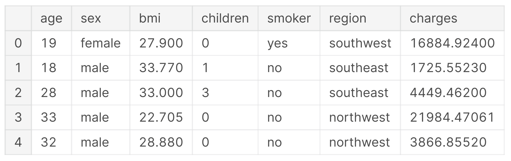
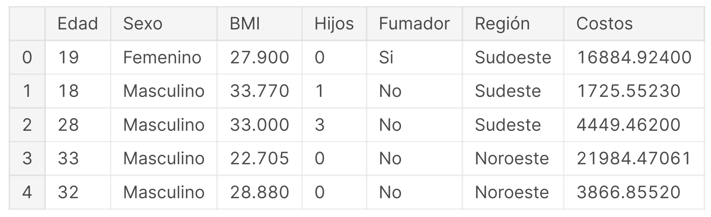
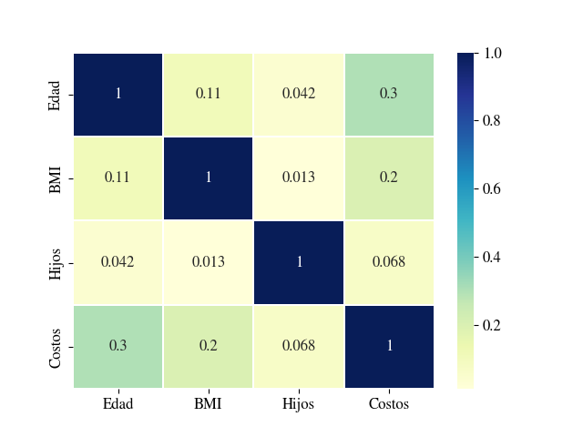
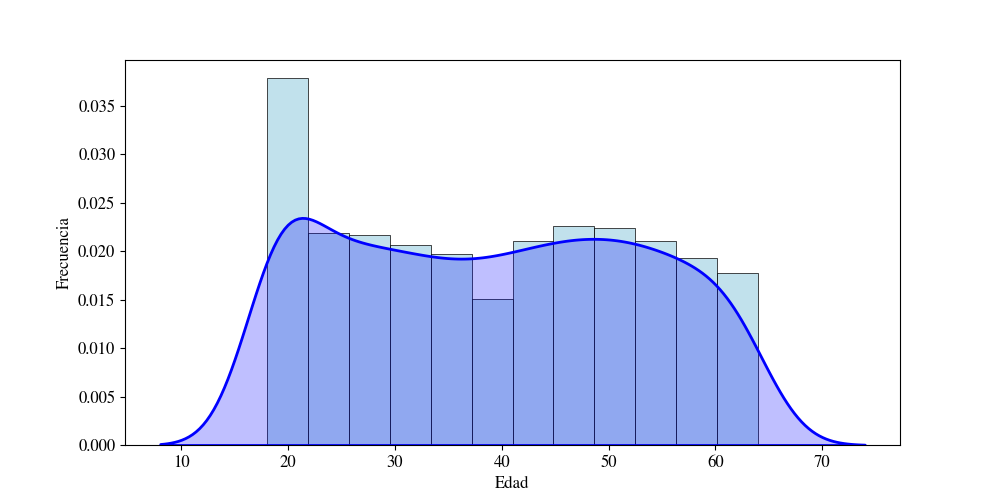
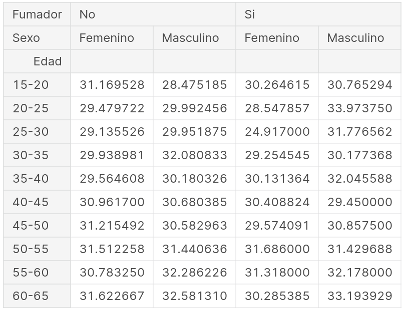
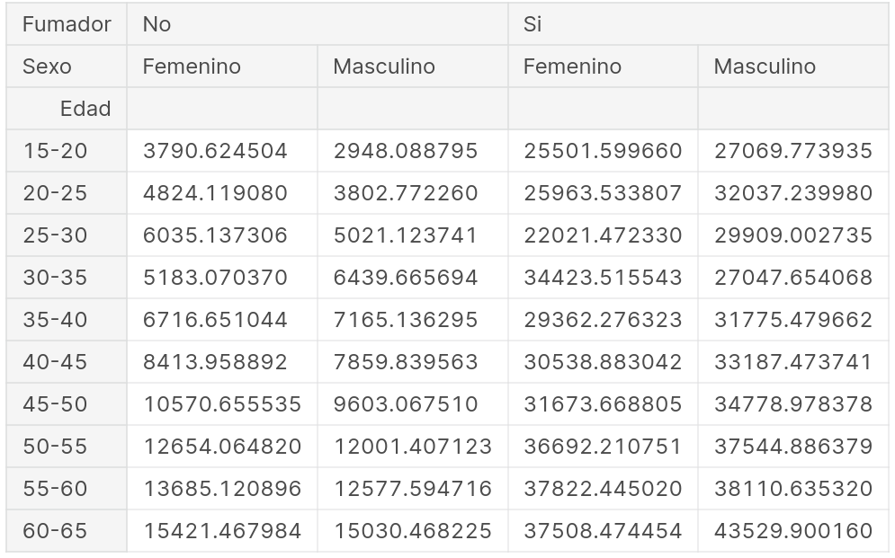
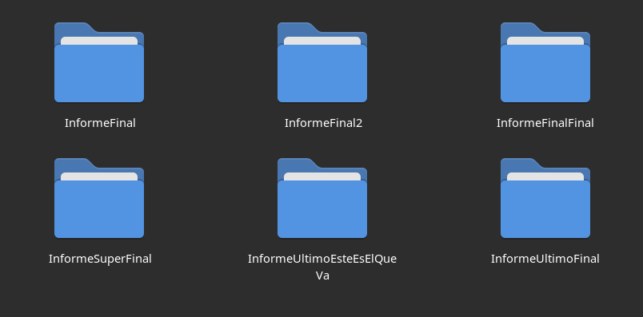

# Del .CSV al .PDF sin escalas: Cómo automatizar la actualización de tablas y gráficos en documentos científicos y técnicos

Ajustar las figuras y transcribir los datos procesados a las tablas de un informe, tesis o artículo, es una tarea algo tediosa, repetitiva y que, ante un pequeño error, obliga a realizar todo el procedimiento desde el principio. Automatizar este trabajo no garantiza ahorrar tiempo, pero sin dudas contribuye a evitar errores y al finalizar la jornada, sentirse un poco más eficiente y menos agobiado.

# *"Nunca gastes 6 minutos en hacer algo a mano cuando puedes perder 6 horas tratando de automatizarlo."*  - [Zhang Zhuowei](https://twitter.com/zhuowei/status/1254266079532154880)

En este artículo-tutorial propongo un flujo de trabajo en el que, partiendo de un archivo con datos crudos en formato ".csv", se logra la actualización del documento final, en formato ".pdf", de forma automática, ya sea por cambios realizados en los propios datos iniciales o en las técnicas de procesamiento aplicadas a los mismos. Este es un ejemplo ilustrativo con la idea de presentar **una** forma de lograrlo, pero vale mencionar que existe una infinidad de herramientas diferentes con el mismo propósito. Para quienes no sepan cómo empezar, alguno de los siguientes lineamientos pueden resultar tanto de utilidad como de inspiración para reformular las tradicionales metodologías de trabajo que son comúnmente empleadas en este ámbito.


## Herramientas

Si bien en otro [artículo anterior](https://www.linkedin.com/pulse/programaci%25C3%25B3n-web-aplicada-computaci%25C3%25B3n-cient%25C3%25ADfica-es-mat%25C3%25ADas-micheletto/) sugerí el uso del navegador web para tareas relacionadas a la actividad académica, en este caso se requerirá cierto uso del almacenamiento local del sistema para gestionar varios archivos, por lo que resulta más apropiado emplear scripts para [Python](https://www.python.org/) y [Bash](https://www.gnu.org/savannah-checkouts/gnu/bash/manual/bash.html).  

Este ejemplo está implementado con software libre y gratuito, por lo que no debería haber limitaciones para replicar el procedimiento en el corto y mediano plazo. Se puede consultar todo el código utilizado durante este tutorial en [este repositorio](https://github.com/matiasmicheletto/csv-pdf-sync) público.

Una buena herramienta colaborativa para redactar contenido técnico extenso es [Overleaf](https://www.overleaf.com/), sin embargo, el documento generado en este ejemplo se compilará con el programa *pdflatex* que viene en el paquete [texlive-full](https://www.tug.org/texlive/). Opcionalmente, se puede usar [Git](https://git-scm.com/) para tener un seguimiento de los cambios en el directorio del proyecto, entre otras ventajas que se detallan más adelante como un [apéndice](#ap%C3%A9ndice-organizaci%C3%B3n-del-directorio-de-trabajo) de este mismo tutorial. 

Finalmente, para ilustrar la tarea de ejecutar los distintos programas en orden y copiar o mover archivos resultantes dentro del directorio, se presentan los pasos en forma de instrucciones para línea de comandos, pero que se pueden realizar por medio de scripts para cualquier *shell*, dependiendo del sistema operativo con el que se trabaje, o incluso con otros programas que cuentan con interfaz gráfica.  


## Procesamiento de los datos

Con la intención de mostrar un ejemplo sencillo, se trabajará sobre el procesamiento de los datos extraídos de un archivo ".csv" que se encuentra disponible en [este sitio](https://www.kaggle.com/datasets/mirichoi0218/insurance). La tabla de datos describe siete atributos observados de 1338 personas diferentes, de manera que se puede obtener, para cada una de ellas, la edad, el sexo, el índice de masa corporal (BMI), la cantidad de hijos, su condición de fumador, la región de residencia y los costos de seguro médico.



Para procesar los datos de este ejemplo, se comienza cargando en memoria el contenido del archivo ".csv", para lo cual se empleará la librería [Pandas](https://pandas.pydata.org/).

```python
import pandas as pd  
  
# Cargar dataframe  
data = pd.read_csv('insurance.csv')  
  
# Imprimir dimensiones, encabezado y metricas  
print(data.shape, end = '\n\n')  
print(data.head(), end = '\n\n')  
print(data.describe(), end = '\n\n')  
```

Como los nombres de las columnas y los datos categóricos están en un idioma diferente al del artículo a redactar, es válido aplicar una traducción al contenido para evitar tener que editar las tablas y figuras posteriormente.

```python
# Traducir columnas
data.rename(columns = {  
    'age': 'Edad',  
    'sex': 'Sexo',  
    'bmi': 'BMI',  
    'smoker': 'Fumador',  
    'region': 'Región',  
    'children': 'Hijos',  
    'charges': 'Costos'  
    }, inplace = True)  
# Traducir datos categóricos
data.replace({  
    'Sexo': {  
        'male': 'Masculino',  
        'female': 'Femenino'  
    },  
    'Fumador': {  
        'yes': 'Si',  
        'no': 'No'  
    },  
    'Región': {  
        'northeast': 'Noreste',  
        'southeast': 'Sudeste',  
        'southwest': 'Sudoeste',  
        'northwest': 'Noroeste'  
    }  
}, inplace = True)  
```



Uno de los inconvenientes que se presenta al insertar figuras en un artículo, es la incosistencia entre las fuentes del documento LaTeX y las del texto presente en las figuras. Una forma de salvar este problema es configurando el formato de los gráficos, en este caso, con la librería [MatPlotLib](https://matplotlib.org/).

```python
import matplotlib as mpl

mpl.rcParams['mathtext.fontset'] = 'stix'  
mpl.rcParams['font.family'] = 'STIXGeneral'  
mpl.rcParams['font.size'] = 12  
```

A continuación, es posible avanzar con la generación de un par de gráficos para simular cierto análisis exploratorio. A modo de ejemplo, se emplea la librería [Seaborn](https://seaborn.pydata.org/) para generar una matriz de correlación entre las columnas. Aquí se puede apreciar la importancia de haber traducido los nombres de las variables del *dataset* y ajustado las fuentes y formatos del texto de la imagen apropiadamente.

```python
import seaborn as sns  
import matplotlib.pyplot as plt  
  
ax = sns.heatmap(data.corr(), annot = True, cmap = 'YlGnBu', linewidths = .2)  
plt.savefig('correlacion.png')  
plt.show()
```

  

Para completar el ejemplo, se agrega una segunda figura que ilustra la distribución de edades de este *dataset* (¿No se parece a una serpiente boa digiriendo un elefante?).

```python
plt.figure(figsize=(10, 5))  
sns.histplot(data['Edad'], color = 'lightblue', stat = 'density', linewidth = 0.5)  
sns.kdeplot(data['Edad'], color = 'blue', linewidth = 2, shade = True)  
plt.ylabel('Frecuencia')  
plt.savefig('edades.png')  
plt.show()
```



Con la intención de generar un par de cuadros para el artículo, se ejecutará un procesamiento con el fin de tabular los valores promedio de BMI y Costos para cada una de las clases que agrupan los datos según rango etario, sexo y condición de fumador. 

```python
 # Agrupar por rango etario en intervalos de 5 años
bins = np.arange(15, 70, 5)
labels = [str(bins[i]) + "-" + str(bins[i+1]) for i in range(len(bins)-1)]  
data['Grupo etario'] = pd.cut(data['Edad'], bins=bins, labels=labels, right=False)  

# Calcular promedios de BMI y Costos de los datos agrupados
averages = data.groupby(['Grupo etario', 'Sexo', 'Fumador'])[['BMI', 'Costos']].mean()  

# Mostrar tabla diferenciando sexo y condicion de fumador, una fila por grupo etario
bmidata = averages['BMI'].unstack().unstack()  
chargesdata = averages['Costos'].unstack().unstack()  
```

### Promedios BMI según edad, sexo y condición de fumador
  
### Promedios de costos de seguro médico según edad, sexo y condición de fumador
  

Finalmente, queda exportar los datos contenidos en las tablas generadas, ```bmidata``` y ```chargesdata```, a formato LaTeX. Una manera directa de lograrlo es mediante la función ```to_latex``` de la librería Pandas. 

```python
print(bmidata.to_latex(caption="Promedios de BMI por edad, sexo y fumador", label="tab:bmi"))
```

En la [documentación](https://pandas.pydata.org/docs/reference/api/pandas.DataFrame.to_latex.html) se detalla cómo utilizar este método de manera efectiva y lograr los resultados deseados. Sin embargo, es posible ahorrarse algunos minutos de lectura mediante la implementación de un breve método que se encargue de generar un archivo de texto con el formato de tabla necesario.

```python
def to_latex(df, caption, label, filename):
    header = ('\\begin{table}[htb]\n'  
        '\t\\label{'+label+'} \n'  
        '\t\\caption{'+caption+'} \n'  
        '\t\\centering\n'  
        '\t\\begin{tabular}{ |c|c|c|c|c| } \n'  
        '\t\t\\hline\n'  
        '\t\t\\multirow{2}{*}{Edad} & \\multicolumn{2}{c|}{No fumador} & \\multicolumn{2}{c|}{Fumador} \\\\ \n'  
        '\t\t\\cline{2-5} \n'  
        '& Masculino & Femenino & Masculino & Femenino \\\\ \n'  
        '\t\t\\hline\n')  
    footer = ('\t\t\\hline \n'  
        '\t\\end{tabular} \n'  
        '\\end{table} \n')  
    content = ''  
    for row in df.index:  
        columndata = " & ".join([str(round(df.loc[row, col],2)) for col in df.columns])  
        content = content + "\t\t" + row + " & " + columndata + " \\\\ \n"  
    with open(filename, 'w') as latexfile:  
        latexfile.write(header+content+footer)  
```

Como se puede observar, esta función toma como argumentos el *dataframe*, la leyenda, la etiqueta identificatoria para referenciarla en el texto y el nombre del archivo de salida con extensión ".tex". Las tablas con formato LaTeX se pueden generar ejecutando la función ```to_latex``` que se acaba de implementar, lo que resultará en un par de archivos listos para importar desde el documento.

```python
to_latex(bmidata, "Promedios de BMI por edad, sexo y fumador", "tab:bmi", "bmi.tex")  
to_latex(chargesdata, "Promedios de costos por edad, sexo y fumador", "tab:costos", "costos.tex")  
```


## Redacción del documento LaTeX

El procedimiento para la redacción del documento LaTeX no se ve afectado para lograr la sincronización del archivo generado en formato ".pdf" con los resultados del análisis realizado en Python. En este ejemplo, se parte de la plantilla para artículos que se encuentra disponible en [este sitio](https://es.overleaf.com/latex/templates/a-simple-article-template/gdsdkccmjnxg).

El contenido del artículo se genera con el paquete [lipsum](https://www.ctan.org/pkg/lipsum) para crear texto de relleno ([Lorem Ipsum](https://www.lipsum.com/)). Las figuras y los gráficos se insertan como referencias a los archivos que contienen las imágenes correspondientes.

```latex
\begin{figure}[ht]  
    \centering  
    \includegraphics[width=\textwidth]{correlacion.png}  
    \caption{Matriz de correlación}  
    \label{fig:correlacion}  
\end{figure}  
```

En el caso de las tablas, se importan directamente los archivos ".tex" generados desde el *script* de Python.

```latex
\input{bmi.tex}  
```

Suponiendo que el artículo está redactado en un fichero con nombre ```main.tex```, es posible generar la salida en formato ".pdf" empleando el software *pdflatex*, mencionado anteriormente.

```bash
pdflatex main.tex  
```

Si todo resulta bien, se obtendrá el artículo final con el nombre "main.pdf". Resta reunir todo el procedimiento en un *script bash* para ejecutar 


## Automatización de todo el proceso

La intención de automatizar la compilación del documento, es que la versión final del artículo se encuentre siempre sincronizada con los resultados obtenidos a partir del procesamiento de los datos crudos originales. Para esto se puede contar con un *script bash* que contenga las instrucciones que son necesarias ejecutar en caso de actualizar el archivo ```insurance.csv``` con los datos, o bien al realizar cambios en los métodos de procesamiento de los mismos. Por cuestiones de compatibilidad en el manejo de librerías de Python, en este ejemplo se utiliza un entorno virtual, cuyas ventajas de uso se detallan en la siguiente sección. 

```bash
cd datos                    # Moverse al directorio "datos"  
source venv/bin/activate    # Activar entorno virtual  
python3 analisis.py         # Correr script Python  
deactivate                  # Desactivar entorno virtual  
cp *.png *.tex ../articulo  # Copiar figuras y tablas generadas  
cd ../articulo              # Moverse al directorio del artículo LaTeX  
pdflatex main.tex           # Compilar documento pdf  
cp main.pdf ../articulo.pdf # Copiar al directorio principal  
```

Para evitar tener que correr estos comandos cada vez que se modifiquen los datos de entrada, se puede guardar estas instrucciones en un fichero, por ejemplo, con el nombre ```sync.sh``` y otorgarle permisos de ejecución. Por último, se puede emplear un escuchador/observador de cambios para disparar la ejecución de todo el procedimiento ante modificaciones en el *script* de Python o en los datos originales. En este ejemplo se usa [entr](https://github.com/eradman/entr), aunque cualquier otro [programa similar](https://anarc.at/blog/2019-11-20-file-monitoring-tools/) puede cumplir con la misma función. 

```bash
while sleep 1 ; do 
    find ./datos -name 'insurance.csv' -o -name 'analisis.py' | entr ./sync.sh 
done
```

Estas instrucciones se deben ejecutar antes de comenzar a trabajar, por lo que también se puede salvar como un *script* con el nombre ```daemon.sh``` y dejarlo corriendo en segundo plano, por ejemplo, con ```nohup```, ```setsid``` o ```disown```. 

```bash
nohup ./daemon.sh >/dev/null 2>&1 &
```

Para verificar que el documento se actualiza correctamente, se puede hacer la prueba de insertar un par de datos atípicos y comparar el documento resultante. Este paso se puede realizar directamente con las siguientes instrucciones:

```bash
# Incorporar dos nuevas observaciones al archivo de datos
echo '64,female,99.99,20,no,northwest,99999' >> datos/insurance.csv  
echo '64,male,99.99,20,no,northwest,99999' >> datos/insurance.csv  
```

Se puede comprobar que cambian los valores en la figura que contiene la matriz de correlación y lo mismo ocurre con las tablas, donde los datos correspondientes al último rango etario de no fumadores, difieren luego de la modificación de los datos originales.  


Finalmente y en caso de no haber aplicado control de versiones al proyecto, se puede revertir este último cambio con:

```bash
# Copiar todo menos las últimas dos líneas a un archivo temporal  
head -n -2 datos/insurance.csv > datos/temp.csv  
# Reemplazar el archivo temporal por el original  
mv datos/temp.csv datos/insurance.csv  
```

## Apéndice: Organización del directorio de trabajo

Mantener el directorio de trabajo organizado permite que el proyecto escale sin afectar a la productividad y es un requisito fundamental para coordinar tareas en todo equipo de trabajo. Quienes acostumbran a versionar los documentos nombrando los ficheros de diferentes formas, como por ejemplo: "InformeFinal.pdf", "InformeFinal2.pdf", "InformeFinalFinal.pdf", "InformeEsteEsElQueVa.pdf", tal vez encuentren muy útil comenzar a manejar herramientas como [Git](https://git-scm.com/), [Mercurial](https://www.mercurial-scm.org/) o [Bazaar](http://wiki.bazaar.canonical.com/) que permiten registrar el histórico de cambios, incorporar modificaciones de los demás colaboradores y también moverse con facilidad entre las distintas versiones del proyecto. 



Al momento de crear un proyecto para Python 3, es recomendable usar entornos virtuales para evitar instalar librerías globalmente, es decir, aquellas que son accesibles por todo el sistema, lo que genera incompatibilidades a largo plazo al trabajar con distintos proyectos en simultáneo. Una forma de prevenir esto es usar el módulo ```venv``` de Python, aunque también existe la opción de instalar el programa ```virtualenv```, que ofrece algunas herramientas adicionales. 

Las siguientes líneas son instrucciones que se pueden ejecutar en la shell del sistema operativo que tenga instalado los programas ```git```, ```virtualenv```, ```python3``` y ```pip3```, pero este ejemplo es ilustrativo y se puede replicar con programas similares o mediante interfaces gráficas.  

```bash
git init # Inicializar repositorio
git checkout -b NOMBRE_RAMA # Crear rama de trabajo (por ej. "test")
# Paso opcional: conectar a repositorio remoto de GitHub
git remote add origin git@github.com:USUARIO/NOMBRE_REPO.git

virtualenv venv # Crear entorno virtual en carpeta "venv"
venv\ > .gitignore # No seguir los cambios de esta carpeta con git
source venv/bin/activate # Activar entorno virtual
pip3 install LISTA_LIBRERIAS # Instalar las librerias a usar (por ej. "pandas")
pip3 freeze > requirements.txt # Guardar librerías y versiones en archivo

... # Trabajar normalmente

deactivate # Paso opcional: Desactivar el entorno virtual
# Registrar cambios
git add . # Agregar todos los ficheros
git commit -m "Primer commit"
git push origin NOMBRE_RAMA # Opcional: sinconizar con repositorio remoto
```
De aquí en adelante, el flujo de trabajo consiste en 1) activar el entorno virtual, 2) trabajar normalmente, luego 3) desactivarlo y opcionalmente, 4) registrar y sincronizar los cambios:

```bash
source venv/bin/activate # Activar entorno virtual

... # Trabajar normalmente

deactivate # Desactivar el entorno virtual
# Registrar cambios
git add . # Agregar todos los ficheros
git commit -m "Nuevos cambios!" # Usar mensajes descriptivos   
git push origin NOMBRE_RAMA # Opcional: sinconizar con repositorio remoto
```

Cuando algún colega necesite descargar el repositorio para probar algo o incorporar cambios, puede instalar exactamente las mismas versiones de las librerías que indicamos en el archivo ```requirements.txt```:

```bash
git clone https://github.com/USUARIO/NOMBRE_REPO.git # Descarga el repositorio
cd NOMBRE_REPO # Ingresa al directorio del proyecto
virtualenv venv # Crea un entorno virtual en carpeta "venv"
source venv/bin/activate # Activa el entorno virtual
pip3 install -r requirements.txt # Instala las librerias requeridas
```

Finalmente, para actualizar el estado del proyecto ante cambios realizados por otros integrantes del equipo, se puede ejecutar la siguiente instrucción:

```bash
git pull origin NOMBRE_RAMA  
```

Luego ```git``` intentará combinar ambas versiones, la remota con la local. En caso de que haya conflictos, éstos deben resolverse manualmente, tema que quedará pendiente para otro tutorial. 